# Data Flow

**Docs references (repo):** [docs/ARCHITECTURE.md](../../docs/ARCHITECTURE.md), [docs/FEATURES.md](../../docs/FEATURES.md)

> **Complete data flow diagrams for ShadowCheck platform**

---

## Overview

This page documents how data flows through the ShadowCheck system, from ingestion to visualization.

---

## Complete Data Flow

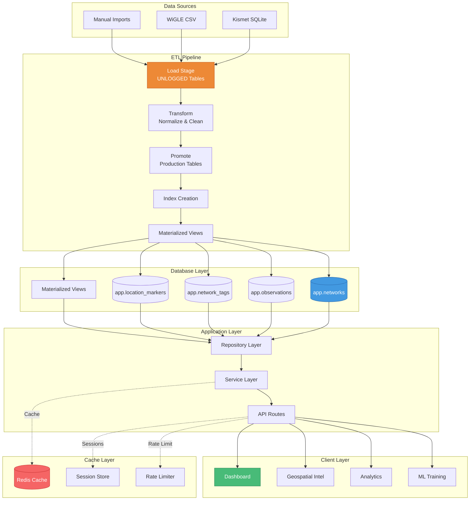

---

## Network Data Flow

````mermaid
sequenceDiagram
    participant Import as Import Script
    participant Staging as Staging Tables
    participant Transform as Transform Logic
    participant Prod as Production Tables
    participant API as API Layer
    participant Client as Frontend

    Import->>Staging: Bulk INSERT (UNLOGGED)
    Note over Staging: Fast writes, no WAL

    Staging->>Transform: Normalize data
    Transform->>Transform: Clean duplicates
    Transform->>Transform: Calculate threat scores
    Transform->>Transform: Enrich manufacturer

    Transform->>Prod: INSERT INTO app.networks
    Transform->>Prod: INSERT INTO app.observations

    Note over Prod: LOGGED tables with indexes

    Prod->>Prod: Trigger: update_network_stats
    Prod->>Prod: Trigger: calculate_threat_score

    Client->>API: GET /api/networks
    API->>Prod: SELECT with filters
    Prod-->>API: Result set
    API-->>Client: JSON response
    ```

    ---

    ## Threat Detection Flow

    ...
    _Last Updated: 2026-03-14_
    A[Network Observation] --> B[Calculate Features]

    B --> C1[Observation Count]
    B --> C2[Unique Days Seen]
    B --> C3[Geographic Spread]
    B --> C4[Signal Strength]
    B --> C5[Distance from Home]
    B --> C6[Behavioral Flags]

    C1 --> D[Rule-Based Scoring]
    C2 --> D
    C3 --> D
    C4 --> D
    C5 --> D
    C6 --> D

    D --> E{ML Model Available?}

    E -->|Yes| F[ML Prediction]
    E -->|No| G[Rule Score Only]

    F --> H[Combine Scores]
    G --> H

    H --> I[Final Threat Score<br/>0-100]

    I --> J{Score > 70?}
    J -->|Yes| K[High Threat]
    J -->|No| L{Score > 40?}
    L -->|Yes| M[Medium Threat]
    L -->|No| N[Low/No Threat]

    style K fill:#f56565,stroke:#c53030,color:#fff
    style M fill:#ed8936,stroke:#c05621,color:#fff
    style N fill:#48bb78,stroke:#2f855a,color:#fff
````

---

## Filter Application Flow

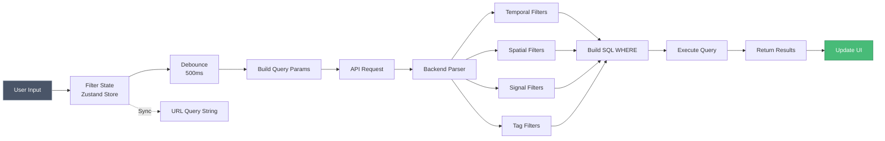

---

## Caching Flow

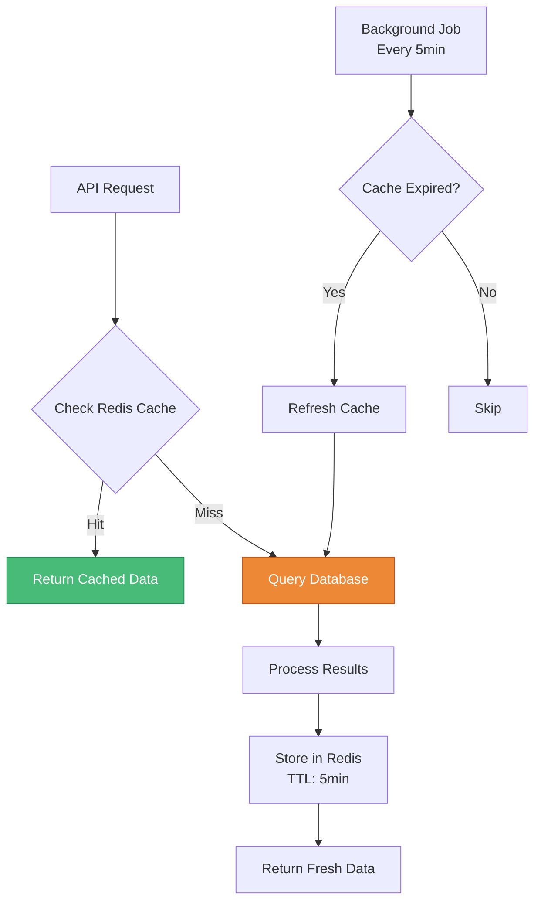

---

## ML Training Flow

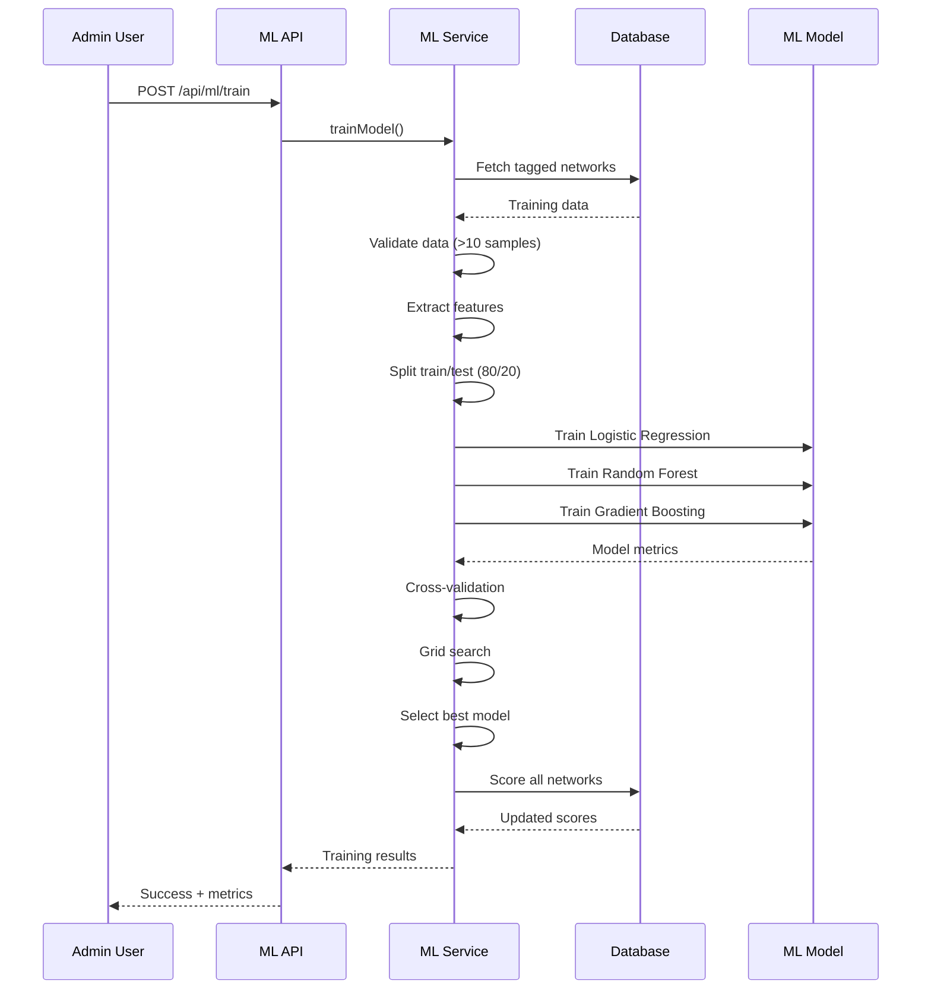

---

## Geospatial Query Flow

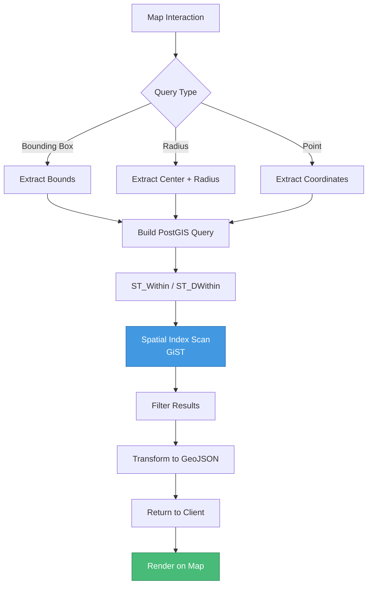

---

## Analytics Aggregation Flow

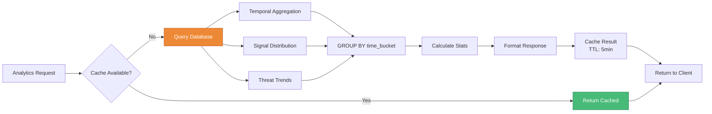

---

## Authentication Flow

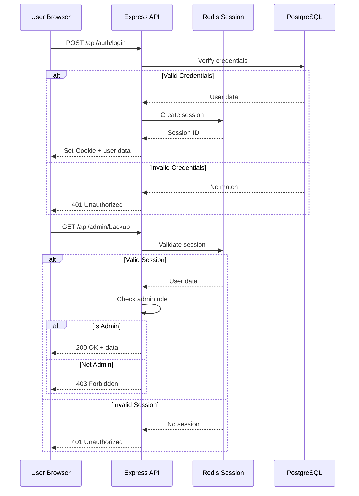

---

## Export Flow

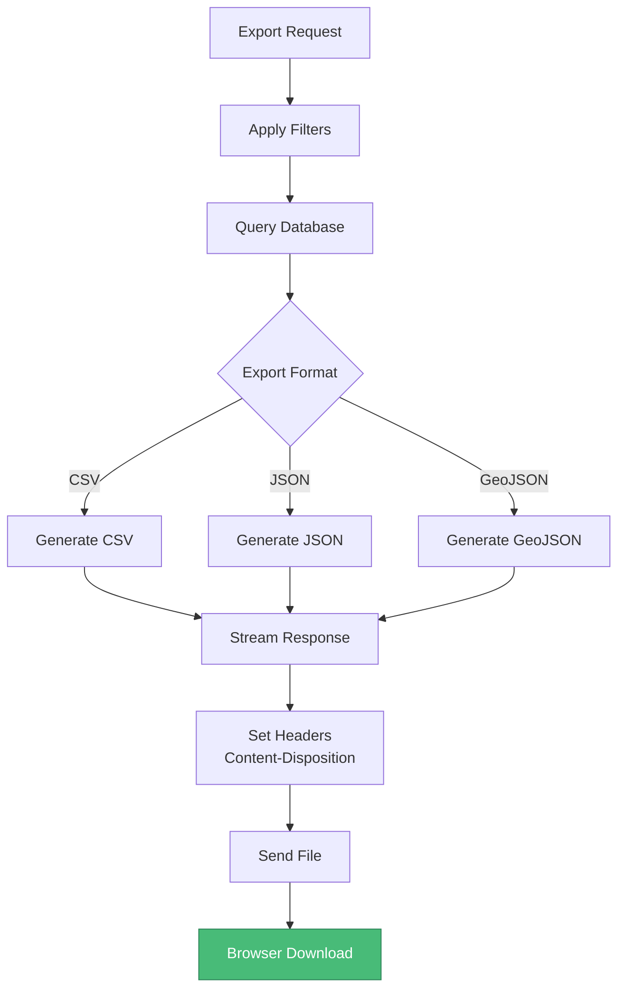

---

## Weather FX Data Flow

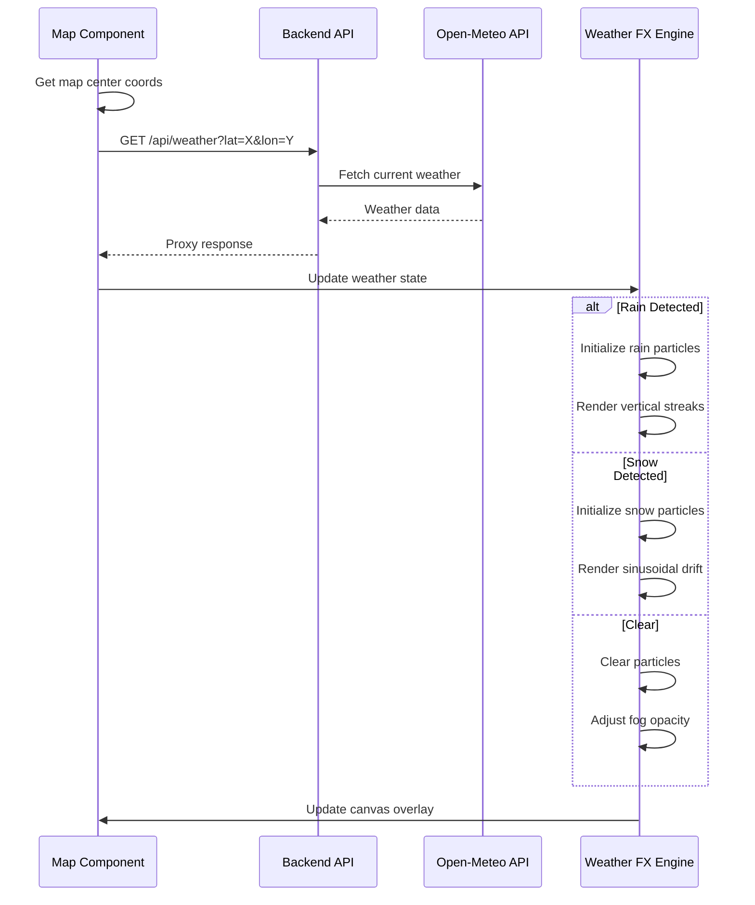

---

## Backup & Restore Flow

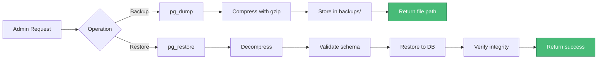

---

## Real-Time Update Flow

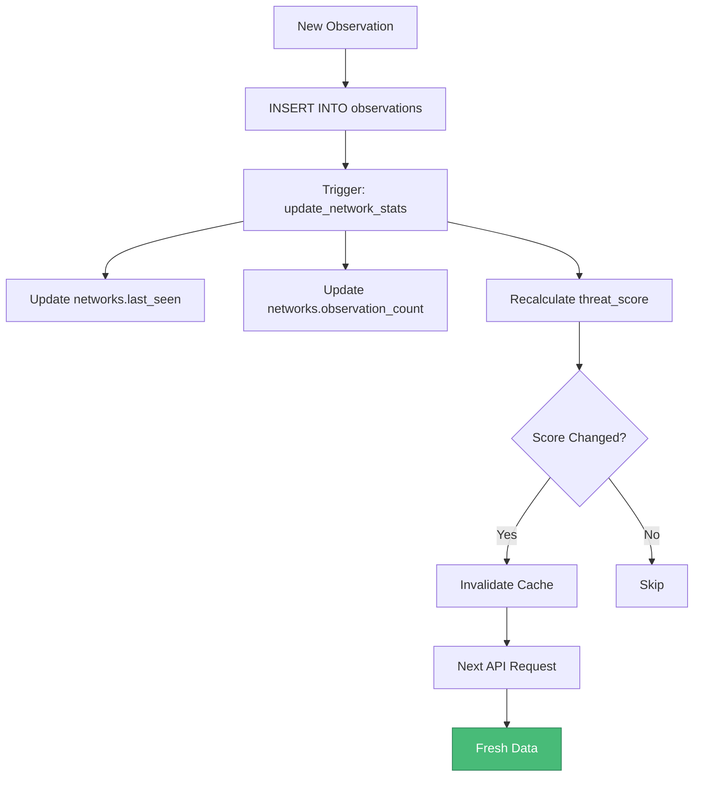

---

_Last Updated: 2026-02-07_
