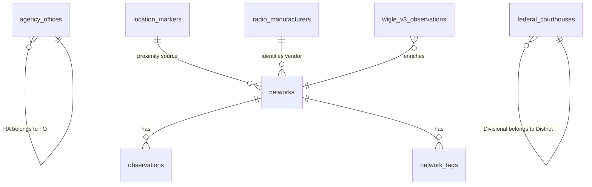

# ShadowCheck Architecture

**Wiki version (diagrams):** [Architecture](../.github/wiki/Architecture.md)

This document describes the high-level architecture of the ShadowCheck-Web platform.

## Table of Contents

- [Overview](#overview)
- [Modularity Philosophy](#modularity-philosophy)
- [System Constraints](#system-constraints)
- [Agency Offices Constraints](#agency-offices-constraints)
- [Frontend Architecture](#frontend-architecture)
- [Client Module Organization](#client-module-organization)
- [Server Module Organization](#server-module-organization)
- [Backend Architecture](#backend-architecture)
- [Data Flow](#data-flow)
- [Database Schema](#database-schema)
- [Agency Offices Data Model](#agency-offices-data-model)
- [Threat Detection Algorithm](#threat-detection-algorithm)
- [Security Architecture](#security-architecture)
- [Development Architecture](#development-architecture)
- [Scalability Considerations](#scalability-considerations)
- [Future Architecture Goals](#future-architecture-goals)

## Overview

ShadowCheck-Web is a SIGINT (Signals Intelligence) forensics platform built on a modern modular architecture combining a React/Vite frontend with a Node.js/Express backend, using PostgreSQL + PostGIS for geospatial data processing and Redis for caching and session management.

Additional architecture assets:

- [Architecture Assets Index](architecture/README.md)
- [ShadowCheck SIGINT Forensics PDF](architecture/ShadowCheck_SIGINT_Forensics.pdf)
- [NotebookLM Mind Map PNG](architecture/NotebookLM%20Mind%20Map.png)

### Core Components

```
┌─────────────────────────────────────────────────────────────┐
│                   React Frontend (Vite)                      │
│  ┌──────────┐  ┌──────────┐  ┌──────────┐  ┌──────────┐   │
│  │Dashboard │  │Geospatial│  │ Analytics│  │ML Training│   │
│  │   Page   │  │   Intel  │  │   Page   │  │   Page    │   │
│  └──────────┘  └──────────┘  └──────────┘  └──────────┘   │
│  ┌──────────┐  ┌──────────┐  ┌──────────┐  ┌──────────┐   │
│  │  Admin   │  │ API Test │  │WiGLE Test│  │Kepler Test│   │
│  │   Page   │  │   Page   │  │   Page   │  │   Page    │   │
│  └──────────┘  └──────────┘  └──────────┘  └──────────┘   │
│                                                             │
│  State Management: Zustand + React Hooks                   │
│  Routing: React Router with lazy loading                   │
│  Styling: Tailwind CSS with dark theme                     │
│  Modules: Weather FX (Canvas Overlay), Mapbox GL JS        │
└───────────────────────────┬─────────────────────────────────┘
                            │ REST API (JSON)
┌───────────────────────────┴─────────────────────────────────┐
│                 Express Server (Node.js)                     │
│  ┌──────────────────────────────────────────────────────┐   │
│  │  API Layer (Modern Modular Architecture)              │   │
│  │  • All routes organized in server/src/api/ structure      │   │
│  │  • Modern routes in server/src/api/ (v2 API)               │   │
│  │  • /api/dashboard-metrics                            │   │
│  │  • /api/threats/quick (paginated)                    │   │
│  │  • /api/networks/* (CRUD operations)                 │   │
│  │  • /api/analytics/* (temporal, signal, security)     │   │
│  │  • /api/ml/* (training, prediction)                  │   │
│  │  • /api/weather (Open-Meteo Proxy)                   │   │
│  └──────────────────────────────────────────────────────┘   │
  │  ┌──────────────────────────────────────────────────────┐   │
  │  Business Logic Layer                                 │   │
  │  • server/src/services/ (modular business logic)            │   │
  │  • AdminDbService (privileged database operations)     │   │
  │  • Threat scoring algorithms                         │   │
│  │  • ML training & prediction services                 │   │
│  │  • Filter query builder with 20+ filter types       │   │
│  └──────────────────────────────────────────────────────┘   │
│  ┌──────────────────────────────────────────────────────┐   │
│  │  Middleware Stack                                     │   │
│  │  • CORS + Rate Limiting (1000 req/15min via Redis)    │   │
│  │  • Security Headers (CSP, X-Frame-Options)           │   │
│  │  • HTTPS Redirect (configurable)                     │   │
│  │  • Request Body Size Limiting (10MB)                 │   │
│  │  • Structured Logging with Winston                   │   │
│  │  • Error Handler with client logger integration      │   │
│  └──────────────────────────────────────────────────────┘   │
└─────────────┬───────────────────────────┬───────────────────┘
              │                           │
              │ Connection Pool (pg)      │ Redis Client
┌─────────────┴────────────────┐     ┌────┴────────────────────────┐
│ PostgreSQL 18 + PostGIS      │     │ Redis 7                     │
│ • Production Data            │     │ • Session Store             │
│ • Materialized Views         │     │ • Rate Limiting             │
│ • Spatial Indexing           │     │ • Analytics Cache           │
│ • Threat Scores              │     │ • Threat Score Cache        │
└──────────────────────────────┘     └─────────────────────────────┘
```

## Modularity Philosophy

ShadowCheck follows **responsibility-based modularity**: each file/module has ONE primary responsibility.

**This is NOT about arbitrary line limits.** A coherent 800-line module is better than an arbitrary 400-line split.

We use 4 tests to identify modularity:

1. **PRIMARY RESPONSIBILITY** - Can you describe it in one sentence?
2. **DISTINCT JOBS** - How many separate concerns?
3. **COHESION** - Do all lines serve the primary responsibility?
4. **INDEPENDENCE** - Can it be understood in isolation?

The same audit framework is now reflected in the current service/module layout and repo conventions.

## System Constraints

The following rules are immutable constraints of the system architecture:

1.  **Kepler.gl Endpoints**: No default pagination limits are applied. The system is designed to handle 1M+ observations without artificial caps.
2.  **Dataset Scaling**: The dataset size scales linearly with observations; no result set limits are imposed on exports or analysis.
3.  **Universal Filters**: The filter system applies uniformly across all pages (Dashboard, Explorer, Analytics) with no page-specific exceptions.
4.  **Distance Calculations**: All distance calculations utilize PostGIS `ST_Distance` (spheroid). No planar approximations or haversine formulas are used in SQL.
5.  **Weather FX Integration**: All weather data is fetched via the `/api/weather` backend proxy. No direct external API calls (e.g., to Open-Meteo) are permitted from the frontend.
6.  **Authentication**: Authentication is session-based using Redis. OAuth and stateless JWTs are not supported.
7.  **API Format**: All API responses use JSON. XML, CSV (except for exports), or other formats are not supported.
8.  **Database**: The system requires PostgreSQL 18+ with PostGIS. Migration to other relational or NoSQL databases is not supported.
9.  **Frontend Framework**: The frontend is built exclusively with React 19 and Vite 7. No other frameworks (Angular, Vue, Next.js) are supported.
10. **Threat Scoring**: Threat scoring utilizes multi-factor analysis. The weights are immutable for each algorithm version to ensure consistency.

## Agency Offices Constraints

1.  **Field Offices**: 56 total primary offices. All must have ZIP+4, PostGIS coordinates, and FBI.gov websites. The count is immutable unless the FBI source is updated.
2.  **Resident Agencies**: 334 total satellite offices. Every record must have a `parent_office`; if missing from source, it is inferred from the nearest field office via PostGIS distance.
3.  **ZIP+4 Coverage**: Field offices maintain 100% ZIP+4 coverage. Resident agencies maintain 93.4% (312/334) coverage. The remaining 22 records are restricted to ZIP5 because Smarty was unable to locate a safe Plus4 candidate.
4.  **Data Integrity**: Original source values are preserved in `address_line1/2` and `phone`. Normalized output is stored in `normalized_*` fields.
5.  **Coordinates**: All 390 records have validated PostGIS POINT locations.
6.  **Phone Format**: Every record has a `normalized_phone` field (10 digits, no leading +1).
7.  **Websites**: 100% coverage. Resident agencies inherit the URL of their parent field office.
8.  **Metadata**: All address corrections, website inheritance, and parent office inferences must be logged in the `metadata` JSONB field.
9.  **Immutability**: Once a resident agency is assigned a `parent_office` (original or inferred), it is permanent until a source refresh. Smarty enrichment is one-way (ZIP5 → ZIP+4); downgrades are prohibited.
10. **Enrichment Source**: Smarty is the sole ZIP+4 provider. Reverse geocoding (Mapbox/Nominatim) is used for validation only and is not stored permanently.

## System Architecture

### Current: Modern Modular React + Express Architecture

**Frontend Characteristics:**

- **React 19** with TypeScript support
- **Vite** build system for fast development and optimized builds
- **Component-based architecture** with lazy loading
- **Zustand** for global state management
- **Tailwind CSS** for responsive, dark-themed UI
- **React Router** with code splitting

**Backend Characteristics:**

- **Modern modular API structure**: All routes organized in `server/src/api/` with service integration
- **Modular services** in `server/src/services/` for business logic and direct database interaction
- **Universal filter system** with modular network, observation, geospatial, and analytics builders
- **Structured logging** with Winston
- **Connection pooling** with PostgreSQL
- **Redis Integration** for caching and session management

**Pros:**

- **Modern development experience** with hot reload and TypeScript
- **Performance optimized** with lazy loading and code splitting
- **Maintainable** with separation of concerns
- **Scalable** frontend architecture
- **SEO ready** with static server and security headers

**Migration Status:**

- ✅ React frontend with modern tooling
- ✅ Component-based UI architecture
- ✅ Universal filter system
- ✅ Modular backend services
- ✅ API route migration
- ✅ TypeScript migration (Full stack)
- 🔄 Modular service decomposition continues

### Frontend Architecture

```
client/src/
├── components/           # React components
│   ├── DashboardPage.tsx        # Main dashboard
│   ├── GeospatialExplorer.tsx / geospatial/  # Map interface
│   ├── AnalyticsPage.tsx        # Charts and analytics
│   ├── KeplerPage.tsx           # Kepler workflow
│   ├── AdminPage.tsx            # System administration
│   ├── FilterPanel.tsx          # Universal filter UI
│   ├── Navigation.tsx           # App navigation
│   └── modals/                  # Modal components
├── hooks/                # Custom React hooks
│   ├── useFilteredData.ts       # Data filtering logic
│   ├── useAdaptedFilters.ts     # Filter adaptation
│   ├── usePageFilters.ts        # Page-specific filters
│   └── useWeatherFx.ts          # Weather visualization orchestration
├── weather/              # Weather FX System
│   ├── weatherFxPolicy.ts       # Fog/Particle logic classification
│   ├── WeatherParticleOverlay.ts # Canvas particle engine
│   ├── openMeteoClient.ts       # Frontend API client
│   └── applyWeatherFog.ts       # Mapbox fog controller
├── stores/               # State management
│   └── filterStore.ts           # Zustand filter store
├── utils/                # Utility functions
│   ├── filterCapabilities.ts    # Filter configuration
│   ├── mapboxLoader.ts          # Mapbox integration
│   └── geospatial/              # Tooltip, popup, and map helpers
├── logging/              # Client-side logging
│   └── clientLogger.ts          # Error reporting
├── types/                # TypeScript definitions
│   └── filters.ts               # Filter type definitions
├── App.tsx               # Main app component
└── main.tsx              # Application entry point
```

### Server Module Organization

#### Validation Schemas (`server/src/validation/schemas/`)

Split by validation domain for clarity and maintainability:

- `networkSchemas.ts` - Network-specific validators (BSSID, SSID, channels)
- `geospatialSchemas.ts` - Location validators (coordinates, radius, altitude)
- `temporalSchemas.ts` - Time-based validators (timestamps, date ranges)
- `commonSchemas.ts` - Generic type validators (string, number, email, URL)
- `complexValidators.ts` - Complex validation logic (address parsing, etc.)
- `schemas.ts` - Index that re-exports all validators

**Why this structure:** Each validation domain is independent. New validators are added to their appropriate domain file.

#### API Routes (`server/src/api/routes/v1/`)

Routes organized by resource with sub-modules for operation types:

- `network-tags/` - Tag management routes
  - `listTags.ts` - GET endpoints
  - `manageTags.ts` - POST/PUT/DELETE endpoints
  - `index.ts` - Router coordinator
- `networks/` - Network endpoints
  - `list.ts` - Main /networks endpoint (835 lines, coherent single purpose)
- `explorer/` - Explorer API routes
  - `networks.ts` - /explorer endpoints

**Why this structure:** Routes grouped by resource, sub-divided by operation type (read vs write).

#### Services (`server/src/services/`)

Domain-specific services with modular internals:

- `analytics/` - Analytics query building
  - `coreAnalytics.ts` - Temporal, signal, radio type queries
  - `threatAnalytics.ts` - Security & threat analytics
  - `networkAnalytics.ts` - Manufacturer, channel, observation counts
  - `helpers.ts` - Normalization & utility functions
  - `index.ts` - Service coordinator

**Why this structure:** Query builders grouped by analytics domain for easier maintenance and testing.

### Backend Architecture

```
server/server.ts                 # Main Express server (modular)
server/src/
├── api/                  # Modern API routes (v2)
│   └── routes/           # Route handlers
│       ├── v1/
│       │   ├── weather.ts      # Weather proxy endpoints
│       │   └── ...
├── services/             # Business logic layer
│   ├── filterQueryBuilder/     # Universal filter system with modular builders
│   ├── threatScoringService.ts # Threat detection
│   ├── mlScoringService.ts     # ML predictions
│   ├── analyticsService.ts     # Analytics queries
│   ├── backgroundJobsService.ts # Background processing
│   └── secretsManager.ts       # Secrets management
├── config/               # Configuration
│   └── database.ts             # Database configuration
├── validation/           # Input validation
│   ├── schemas.ts              # Joi validation schemas
│   └── middleware.ts           # Validation middleware
├── errors/               # Error handling
│   ├── AppError.ts             # Custom error classes
│   └── errorHandler.ts         # Global error handler
└── logging/              # Server-side logging
    ├── logger.ts               # Winston logger
    └── middleware.ts           # Request logging
```

### Client Module Organization

#### Components (`client/src/components/`)

Organized by feature with sub-components for distinct concerns:

**Geospatial Ecosystem:**

- `geospatial/GeospatialExplorer.tsx` (622 lines)
  - **Scheduled for refactoring:**
    - `MapContainer.tsx` - Map viewport & rendering
    - `LocationControls.tsx` - Map controls
    - `ResizeHandler.tsx` - Container sizing
- `geospatial/useGeospatialMap.ts` (506 lines)
  - Custom hook for map initialization & state

**Visualization:**

- `KeplerPage.tsx` (626 lines)
  - **Scheduled for refactoring:**
    - `KeplerVisualization.tsx` - Visualization rendering
    - `KeplerControls.tsx` - User controls
    - `KeplerFilters.tsx` - Data filtering
- `AnalyticsCharts.tsx` (501 lines) - Multiple chart types, single orchestration purpose

**Configuration:**

- `ConfigurationTab.tsx` (501 lines)
  - **Scheduled for refactoring:** Extract by config domain (Mapbox, Google Maps, AWS, etc.)

**Admin:**

- `admin/` - Admin interface with feature-specific sub-components

## Data Flow

### Threat Detection Request Flow

```

User Request
↓
[Frontend] → GET /api/threats/quick?page=1&limit=100&minSeverity=40
↓
[Middleware] → Rate Limiting (Redis) → CORS → Authentication (Redis Session)
↓
[Route Handler] → Parse & Validate Query Params
↓
[Threat Service] → Check Redis Cache
├─→ [Cache Hit] → Return Cached Score
└─→ [Cache Miss] → Calculate Threat Scores
    ↓
    [Repository Layer] → Query Database (CTEs)
    ↓
    [PostgreSQL] → Execute Query with PostGIS Distance Calculations
    ↓
    [Repository Layer] → Map DB Results to Domain Models
    ↓
    [Threat Service] → Cache Result in Redis (5 min TTL)
↓
[Route Handler] → Format Response
↓
[Frontend] → Render Threat Table

```

### Weather FX Request Flow

```
[Frontend Map Move] → useWeatherFx Hook
↓
[openMeteoClient] → GET /api/weather?lat=...&lon=...
↓
[Express Proxy] → GET https://api.open-meteo.com/v1/forecast?...
↓
[Open-Meteo API] → Returns JSON (Temp, Code, CloudCover)
↓
[Frontend] → weatherFxPolicy.ts (Classifies weather: Rain/Snow/Clear)
├─→ [applyWeatherFog] → Update Mapbox Fog (Color/Range)
└─→ [WeatherParticleOverlay] → Render Canvas Particles (Rain/Snow)
```

### Enrichment Data Flow

```

[WiGLE CSV Import] → Import Script
↓
[PostgreSQL] → app.wigle_networks_enriched
↓
[Enrichment System] → Multi-API Venue Lookup
├─→ [LocationIQ API] → Conflict Resolution
├─→ [OpenCage API] → Voting System
├─→ [Overpass API] → Best Match Selection
└─→ [Nominatim API] → Gap Filling
↓
[PostgreSQL] → app.ap_addresses (venue names, categories)
↓
[Frontend] → Display Enriched Network Data

```

## Database Schema

### Core Entities

| Table                       | Primary Key | Description                                                |
| :-------------------------- | :---------- | :--------------------------------------------------------- |
| `app.networks`              | `bssid`     | Master registry of detected wireless networks.             |
| `app.observations`          | `id`        | Individual sightings with signal strength and coordinates. |
| `app.network_tags`          | `id`        | Manual classifications and forensic notes.                 |
| `app.location_markers`      | `id`        | User-defined points of interest (Home, Work).              |
| `app.agency_offices`        | `id`        | FBI Field Offices and Resident Agencies dataset.           |
| `app.federal_courthouses`   | `id`        | US District and Circuit Court locations (357 records).     |
| `app.radio_manufacturers`   | `prefix`    | Standardized OUI-to-vendor mapping (74k+ records).         |
| `app.wigle_v3_observations` | `id`        | Crowdsourced enrichment data from WiGLE API.               |

### Entity Relationships



## Agency Offices Data Model

| Column                   | Type       | Description                          |
| :----------------------- | :--------- | :----------------------------------- |
| `id`                     | `integer`  | Primary identifier.                  |
| `agency`                 | `text`     | Name of the agency (e.g., 'FBI').    |
| `office_type`            | `text`     | 'field_office' or 'resident_agency'. |
| `name`                   | `text`     | Name of the office/region.           |
| `parent_office`          | `text`     | Parent Field Office name (for RAs).  |
| `address_line1`          | `text`     | Original street address.             |
| `postal_code`            | `text`     | ZIP+4 or ZIP5 code.                  |
| `phone`                  | `text`     | Original phone number string.        |
| `website`                | `text`     | Direct or inherited website URL.     |
| `location`               | `geometry` | PostGIS POINT (4326).                |
| `normalized_phone`       | `text`     | Cleaned 10-digit number.             |
| `normalized_postal_code` | `text`     | ZIP+4 validated code.                |
| `metadata`               | `jsonb`    | Enrichment logs and inference flags. |

## Federal Courthouses Data Model

| Column            | Type       | Description                                 |
| :---------------- | :--------- | :------------------------------------------ |
| `id`              | `integer`  | Primary identifier.                         |
| `name`            | `text`     | Official courthouse name.                   |
| `courthouse_type` | `text`     | district_court, specialty_court, etc.       |
| `district`        | `text`     | US District (e.g. 'Eastern District of MI') |
| `circuit`         | `text`     | US Circuit (e.g. 'Sixth Circuit')           |
| `city`            | `text`     | City location.                              |
| `state`           | `text`     | 2-letter State code.                        |
| `location`        | `geometry` | PostGIS POINT (4326).                       |
| `active`          | `boolean`  | Record status flag.                         |

## Threat Detection Algorithm

### Scoring Criteria (Multi-Factor Analysis)

```javascript
const threatScore = (network) => {
  let score = 0;

  // CRITICAL: Seen both at home AND away from home
  if (network.seenAtHome && network.seenAwayFromHome) {
    score += 40; // Strongest indicator of tracking
  }

  // HIGH: Distance range exceeds WiFi range (200m)
  if (network.distanceRange > 0.2) {
    // km
    score += 25;
  }

  // MEDIUM: Temporal persistence (multiple days)
  if (network.uniqueDays >= 7) {
    score += 15;
  } else if (network.uniqueDays >= 3) {
    score += 10;
  } else if (network.uniqueDays >= 2) {
    score += 5;
  }

  // LOW: High observation count
  if (network.observationCount >= 50) {
    score += 10;
  } else if (network.observationCount >= 20) {
    score += 5;
  }

  // ADVANCED: Movement speed analysis
  if (network.maxSpeed > 100) {
    // km/h
    score += 20; // Vehicular tracking device
  } else if (network.maxSpeed > 50) {
    score += 15;
  } else if (network.maxSpeed > 20) {
    score += 10;
  }

  return score;
};
```

### Detection Modes

**1. Quick Detection (Paginated)**

- Location: `server/server.ts`
- Endpoint: `GET /api/threats/quick`
- Features:
  - Fast aggregation queries
  - Pagination support (default: 100 results)
  - User-defined severity threshold
  - Basic distance calculations
- Use Case: Dashboard overview, initial screening

**2. Advanced Detection (Full Analysis)**

- Location: `server/server.ts`
- Endpoint: `GET /api/threats/detect`
- Features:
  - Speed calculations between observations
  - Temporal sequencing (order by time)
  - Detailed movement patterns
  - All observations included
- Use Case: Deep investigation, forensic analysis

### False Positive Filtering

```sql
-- Cellular networks excluded unless exceptional range
WHERE NOT (
  type IN ('G', 'L', 'N')
  AND distance_range_km < 5.0
)

-- Minimum valid timestamp (Jan 1, 2000)
WHERE time >= 946684800000

-- Minimum observations for statistical significance
HAVING COUNT(DISTINCT location_id) >= 2
```

## Security Architecture

### Authentication & Authorization

**Role-Based Access Control (RBAC)**

- **Admin Role**: Required for `/admin` page access and data-modifying operations (tagging, imports).
- **User Role**: Standard access to dashboards and mapping.
- **Middleware**: `requireAdmin` gates privileged backend routes.

**API Key Authentication**

- Environment variable: `API_KEY`
- Header: `x-api-key`
- Protected endpoints:
  - `GET /api/admin/backup`
  - `POST /api/admin/restore`

**Threat Model**

- **Primary Threat**: Unauthorized data access and manipulation
- **Mitigation**:
  - Rate limiting (1000 req/15min per IP) via Redis
  - API key for sensitive endpoints
  - CORS origin whitelisting
  - SQL injection prevention (parameterized queries)
  - XSS prevention (HTML escaping in frontend)
  - Request body size limiting (10MB)

### Security Headers

```javascript
// CSP, X-Frame-Options, X-XSS-Protection
res.setHeader(
  'Content-Security-Policy',
  "default-src 'self'; " +
    "script-src 'self' 'unsafe-inline' 'unsafe-eval' https://cdn.jsdelivr.net; " +
    "style-src 'self' 'unsafe-inline' https://cdn.jsdelivr.net; " +
    "connect-src 'self' https://api.mapbox.com;"
);
res.setHeader('X-Frame-Options', 'DENY');
res.setHeader('X-XSS-Protection', '1; mode=block');
res.setHeader('Strict-Transport-Security', 'max-age=31536000');
```

### Secrets Management

**Current:**

- AWS Secrets Manager for credentials (db_password, wigle_api_token, etc.)
- `secretsManager.ts` handles loading from AWS SM (env vars only for explicit overrides).
- No hardcoded tokens in frontend; served via protected backend endpoints.

## Scalability Considerations

### Current Limitations

**Database:**

- Single PostgreSQL instance
- No read replicas
- Connection pool: 20 max connections
- No query caching (except OS-level)

**Application:**

- Single-threaded Node.js
- No horizontal scaling
- No load balancer
- No CDN for static assets

**Storage:**

- ~566K location records
- ~173K unique networks
- Growing linearly with observations

### Scaling Path

**Short-Term (0-100K users)**

```
┌────────────┐
│  Nginx LB  │
└─────┬──────┘
      │
      ├─→ [API Instance 1]
      ├─→ [API Instance 2]
      └─→ [API Instance 3]
           │
           ↓
      [PostgreSQL Primary]
           │
           ├─→ [Read Replica 1]
           └─→ [Read Replica 2]
```

**Medium-Term (100K-1M users)**

- Add Redis for caching (threat scores, analytics)
- Separate read/write databases
- CDN for static frontend (CloudFlare)
- API rate limiting per user (not just per IP)
- Database partitioning by time range

**Long-Term (1M+ users)**

- Microservices architecture:
  - Threat Detection Service
  - Enrichment Service
  - Analytics Service
  - ML Service
- Event-driven architecture (Kafka)
- TimescaleDB for time-series observations
- Elasticsearch for full-text search
- S3 for observation archives

## Future Architecture Goals

### Phase 1: Modularization (Completed)

- [x] Break `server/server.js` into modules
- [x] Implement repository pattern
- [x] Add service layer for business logic
- [x] Create typed configuration management
- [x] Add comprehensive unit tests

### Phase 2: Data Layer Optimization (In Progress)

- [x] Add Redis caching layer
- [ ] Implement database read replicas
- [x] Add connection pool monitoring
- [x] Optimize slow queries with materialized views
- [x] Implement background job queue (Bull)

### Phase 3: Security Hardening (Planned)

- [x] Use AWS Secrets Manager for secrets
- [ ] Implement OAuth2 authentication
- [x] Add audit logging for all mutations
- [ ] Implement field-level encryption for PII
- [x] Add API versioning (v1, v2)

### Phase 4: ML Enhancement (Planned)

- [ ] Real-time threat detection (websockets)
- [x] Improved ML model (ensemble methods)
- [ ] Anomaly detection (isolation forest)
- [ ] Temporal pattern analysis (LSTM)
- [x] Automated retraining pipeline

### Phase 5: Observability (Planned)

- [x] Structured logging (JSON format)
- [ ] Correlation IDs for request tracing
- [ ] Prometheus metrics export
- [ ] Grafana dashboards
- [ ] OpenTelemetry integration
- [ ] Error tracking (Sentry)

## Technology Stack

**Backend:**

- Node.js 22+ (LTS)
- Express 4.x (HTTP server)
- pg 8.x (PostgreSQL client)
- PostgreSQL 18 + PostGIS (geospatial database)
- Redis 7.0+ (Caching, Sessions)

**Frontend:**

- React 19 (TypeScript)
- Vite 7 (Build Tool)
- Tailwind CSS (utility-first CSS)
- Recharts / Chart.js (visualizations)
- Mapbox GL JS / Deck.gl (mapping)
- Zustand (State Management)

**Runtime:**

- npm 11+ (Dependency Management)
- Docker (Containerization)

**DevOps:**

- Docker + Docker Compose (containerization)
- GitHub Actions (CI/CD)
- PostgreSQL (database)
- Redis (cache)

**Testing:**

- Jest (unit & integration tests)
- Supertest (API testing)

**Code Quality:**

- ESLint (linting)
- Prettier (formatting)
- EditorConfig (editor consistency)

---

For detailed API documentation, see [API.md](API.md).
For deployment instructions, see [DEPLOYMENT.md](DEPLOYMENT.md).
For development setup, see [DEVELOPMENT.md](DEVELOPMENT.md).
