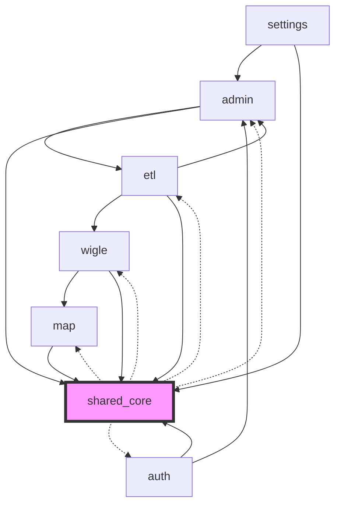

# Full Modularity Audit Report (2026-04-18)

## 1. Executive Summary & Cross-Agent Synthesis

### Dependency Graph

### Highest-Risk Coupling
**`shared/core` -> Business Domains (`wigle`, `auth`, `admin`, `map`, `etl`)**
The matrix reveals that `shared/core` imports from nearly every other domain. This creates massive **circular dependencies** across the entire codebase. A shared utility or core configuration layer should sit at the bottom of the dependency tree (only being imported, never importing specific feature domains). 

**`auth` -> `admin`**
Functionally, `AuthService` relies directly on `adminUsersService`, and the `auth.ts` route file includes `/api/admin/users` endpoints. This blurs the line between session management (Auth) and user lifecycle (Admin), creating a split-brain architecture.

### Prioritized Refactor Roadmap
1. **Purge Core/Shared Circularity (Critical):** Remove business logic imports from `server/src/utils/` and `server/src/middleware/`. Move initialization orchestration (`*Init.ts`) out of utilities and into a dedicated `server/src/core/initialization/` layer to decouple from feature services.
2. **Untangle Auth and Admin (High):** Move all user management routes from `auth.ts` to `admin/users.ts`. Sever the direct dependency between `AuthService` and `adminUsersService`.
3. **Consolidate Threat Scoring (Medium-High):** Unify the rule-based PL/pgSQL function (`calculate_threat_score_v5`) and the TypeScript behavioral scoring into a single cohesive service layer to eliminate duplicate calculation engines.
4. **Standardize WiGLE Interfaces (Medium):** Migrate `wigleEnrichmentService` to use the DI container instead of raw `require` statements. Unify frontend `wigleApi.ts` patterns.
5. **Decouple Map Context (Medium):** Split the God hook `useNetworkContextMenu` into focused, single-responsibility hooks.

### Regressed Domains
- **Auth**: The presence of admin routes in the auth router and `authService.listUsers()` calling admin functions indicates a recent degradation in domain boundaries.
- **Shared/Core**: Has become bloated with application lifecycle orchestration, leading to cyclic dependencies with services.

---

## 2. Parallel Codex Track

### Cross-Domain Import Matrix

| Source \ Imported | settings | scoring | wigle | auth | admin | map | etl | shared/core |
| --- | --- | --- | --- | --- | --- | --- | --- | --- |
| settings | 0 | 0 | 0 | 0 | 1 | 0 | 0 | 1 |
| scoring | 0 | 0 | 0 | 0 | 0 | 0 | 0 | 0 |
| wigle | 0 | 0 | 62 | 0 | 0 | 20 | 0 | 95 |
| auth | 0 | 0 | 0 | 4 | 4 | 0 | 0 | 10 |
| admin | 0 | 0 | 0 | 0 | 287 | 0 | 4 | 127 |
| map | 0 | 0 | 0 | 0 | 0 | 252 | 0 | 206 |
| etl | 0 | 0 | 4 | 0 | 2 | 0 | 66 | 2 |
| shared/core | 0 | 0 | 20 | 4 | 4 | 46 | 2 | 955 |

### Circular Dependencies
- `shared/core` creates circular dependencies with `wigle`, `auth`, `admin`, `map`, and `etl`.
- Specifically within `server/src`: `services/filterQueryBuilder/FilterBuildContext.ts` <-> `services/filterQueryBuilder/networkWhereBuilder.ts`.

### Multi-Domain Importers (>= 3 domains)
No single file imports from 3 or more domains simultaneously, indicating that while domains are coupled, individual files remain somewhat focused.

---

## 3. Domain Reports

### WiGLE
1. **Boundary clarity:** `server/src/services/wigleEnrichmentService.ts` imports `adminDbService`, `secretsManager`, `logger`. Inbound coupling from `client/src/api/adminApi.ts` and `networkApi.ts`.
2. **Single responsibility:** Well-decomposed (`wigleService`, `wigleImportService`, `wigleSearchApiService`).
3. **Coupling score:** **Medium**. Heavy reliance on shared infrastructure via direct `require` instead of DI.
4. **Interface quality:** High on backend, moderate to poor on frontend (`wigleApi.ts` mixes raw fetch and `apiClient`).
5. **Duplication:** Overlap in SQL construction between `wigleService.ts` and `wigleQueriesRepository.ts`.
6. **Test isolation:** High for containerized services, low for services using direct `require`.
7. **Top 3 refactor recommendations:** DI Migration for `wigleEnrichmentService`, frontend API standardization, convert CommonJS `require` to ES `import`.

### Auth
1. **Boundary clarity:** `server/src/services/authService.ts` imports `createAppUser` from `adminUsersService`. `server/src/api/routes/v1/auth.ts` calls `authService.listUsers()` and defines `/api/admin/users`.
2. **Single responsibility:** Violates SRP by including admin-level user creation in auth routes/services.
3. **Coupling score:** **Medium-High**. Significant functional coupling between Auth and Admin.
4. **Interface quality:** Backend returns consistent result objects. Frontend `useAuth` hook provides clean abstraction.
5. **Duplication:** High. `/api/admin/users` endpoints duplicated in both auth and admin routers.
6. **Test isolation:** Good. Extensive unit tests with proper mocking.
7. **Top 3 refactor recommendations:** Purge duplicate admin routes from auth, fix boundary leaks (`listUsers`), consolidate user management.

### Settings
1. **Boundary clarity:** Route `admin/settings.ts` imports background jobs and feature flags. `settingsAdminService.ts` imports `adminQuery` from parent directory.
2. **Single responsibility:** `settings.ts` orchestrates both app settings and local stack Docker controls (violating SRP).
3. **Coupling score:** **Medium**. Coupled with Admin infra and BackgroundJobs, mitigated by DI container.
4. **Interface quality:** Clean functional exports (backend). Clean `useConfiguration` abstraction (frontend).
5. **Duplication:** `envFlag` utility logic duplicated in route files.
6. **Test isolation:** High (`secretsManager.ts` tested comprehensively).
7. **Top 3 refactor recommendations:** Extract docker-compose orchestration to a dedicated service, consolidate env utilities, adopt Repository Pattern for `settingsAdminService.ts`.

### Admin
1. **Boundary clarity:** Imports from WiGLE (`wigleService`), Geocoding (`geocodingCacheService`), PgAdmin, and BackgroundJobs. Outward coupling is expected for Admin.
2. **Single responsibility:** Services are well-focused, but the `admin` route directory acts as a bloated catch-all.
3. **Coupling score:** **Medium**. Inherently coupled to feature domains to manage them.
4. **Interface quality:** Consistent Service-Query pattern and DI container abstraction.
5. **Duplication:** Fragmentation and duplication across `adminHelpers.ts`, `importHelpers.ts`, and `kmlImportUtils.ts`.
6. **Test isolation:** High for services, routes rely heavily on global container context.
7. **Top 3 refactor recommendations:** Directory consolidation for admin services, harden DI usage (remove relative requires), unify fragmented helper files.

### Map
1. **Boundary clarity:** Fair, but significant leakage to global stores and constants.
2. **Single responsibility:** `useNetworkContextMenu` is a "God Hook" managing tagging, lookups, and fetching.
3. **Coupling score:** **Medium-High**. Extensive `state: any` usage in `GeospatialMapContent`.
4. **Interface quality:** Poor, lacks formalized types for core map context boundaries.
5. **Duplication:** String-template logic duplicated in tooltip rendering.
6. **Test isolation:** Low. Zero test coverage for core interaction hooks.
7. **Top 3 refactor recommendations:** Split `useNetworkContextMenu`, formalize `GeospatialMapContent` interface, decompose tooltip renderer.

### Scoring
1. **Boundary clarity:** `backgroundJobs/runners.ts` imports `ml/repository`. `threats.ts` routes import from validation and infra.
2. **Single responsibility:** Low. `ThreatScoringService` acts as a thin wrapper for a God SQL function. Scoring logic is fragmented between SQL and TS.
3. **Coupling score:** **High**. Core business logic deeply embedded in PL/pgSQL, strictly binding the app layer to the DB schema.
4. **Interface quality:** Medium-Low. Inconsistent class/function exports and brittle manual row mapping in routes.
5. **Duplication:** High. Rule-based SQL scoring and TS behavioral scoring attempt to calculate similar metrics independently.
6. **Test isolation:** Medium. Mocks exist, but real scoring logic in SQL remains untested by JS suite.
7. **Top 3 refactor recommendations:** Consolidate scoring logic into the service layer, implement a dedicated ThreatRepository, formalize DTOs for threat data mapping.

### ETL
1. **Boundary clarity:** Fully isolated from backend app code (zero `server/src` imports). Maintains its own DB utils.
2. **Single responsibility:** High. Directory structure (`load/`, `transform/`, `promote/`) strictly follows lifecycle.
3. **Coupling score:** **Low-Medium**. Coupled tightly to DB schema, but isolated from API/Service layers.
4. **Interface quality:** Consistent CLI interfaces via `tsx`.
5. **Duplication:** Moderate duplication of database connection logic between `etl/utils/db.ts` and `server/src/config/database.ts`.
6. **Test isolation:** High. Very portable logic.
7. **Top 3 refactor recommendations:** Consolidate DB configuration (retaining separate roles), implement ETL repositories (remove raw queries from scripts), formalize schema validation via Zod/Joi.

### Shared/Core
1. **Boundary clarity:** Violations detected. Utils import from services (`validateSecrets.ts` -> `secretsManager`, `cacheMiddleware.ts` -> `cacheService`).
2. **Single responsibility:** Bloated with initialization logic (`appInit.ts`, `databaseInit.ts`) alongside generic helpers.
3. **Coupling score:** **Medium** (operationally), but represents a massive architectural vulnerability due to circular dependencies on business domains.
4. **Interface quality:** High (consistent TypeScript, enterprise-grade loggers) but inconsistent validation patterns (`validators.ts` vs Zod).
5. **Duplication:** Geospatial logic duplicated between `mapHelpers.ts` and `wigle/colors.ts`. Validation helpers overlap with full schemas.
6. **Test isolation:** Excellent on backend, high on frontend.
7. **Top 3 refactor recommendations:** Extract Initialization layer to `server/src/core/initialization/`, consolidate geospatial utils, decouple middleware from specific service instances via DI.

## Remediation - 2026-04-18

### Updated Dependency Graph

The graph remains materially unchanged. No dotted `shared/core` circular edges were removed in the landed tree because the `shared/core` remediation track did not complete.

### Matrix Delta

The coarse import matrix was regenerated from the current tree with `python3 analyze_imports.py`.

| Edge | Before | After | Notes |
| --- | --- | --- | --- |
| `auth -> admin` | 4 | 2 | Improved. `authService.ts` no longer creates users, admin user routes moved to `admin/users.ts`, and `authWrites.ts` no longer falls back through `adminUsersService`. |
| `admin -> etl` | 4 | 2 | Improved. Admin import helpers now centralize ETL command resolution in `server/src/services/admin/adminHelpers.ts`. |
| `scoring -> shared/core` | 0 | 2 | Increased. New typed orchestration and repository files add explicit shared/core imports. |
| `wigle -> shared/core` | 95 | 99 | Increased slightly. WiGLE cleanup reduced duplication and raw fetch usage, but the coarse script counts additional shared-core imports from the refactor. |
| `shared/core -> *` | unchanged at `wigle 20 / auth 4 / admin 4 / map 46 / etl 2` | unchanged | The critical circularity work did not land. |

### Sub-Agent 1 - Purge Shared/Core Circularity

Changed:
- No substantive changes from this track are present in the current tree.

Skipped:
- `server/src/core/initialization/` was not created.
- `server/src/utils/validateSecrets.ts` still imports `secretsManager`.
- `server/src/middleware/cacheMiddleware.ts` still imports `cacheService`.
- `FilterBuildContext.ts` / `networkWhereBuilder.ts` were not reworked in the landed diff.

Remaining:
- This remains the highest-risk architectural item from the audit.
- The dotted `shared/core` circular edges in the graph remain valid.

### Sub-Agent 2 - Untangle Auth and Admin

Changed:
- `/api/admin/users` handling now lives in [server/src/api/routes/v1/admin/users.ts](/home/dbcooper/repos/shadowcheck-web/server/src/api/routes/v1/admin/users.ts:1) and is mounted from [server/src/api/routes/v1/admin.ts](/home/dbcooper/repos/shadowcheck-web/server/src/api/routes/v1/admin.ts:1).
- [server/src/services/authService.ts](/home/dbcooper/repos/shadowcheck-web/server/src/services/authService.ts:1) no longer imports admin user creation logic and no longer owns user listing or creation behavior.
- [server/src/services/authWrites.ts](/home/dbcooper/repos/shadowcheck-web/server/src/services/authWrites.ts:1) now handles its password-update fallback locally instead of calling `adminUsersService.resetAppUserPassword`.
- [client/src/api/client.ts](/home/dbcooper/repos/shadowcheck-web/client/src/api/client.ts:1) now preserves `FormData` bodies, which keeps admin user and WiGLE upload flows aligned with the shared client.

Confirmed:
- The auth router should not serve `/api/v1/admin/users`; [tests/integration/api/v1/auth.test.ts](/home/dbcooper/repos/shadowcheck-web/tests/integration/api/v1/auth.test.ts:1) now asserts that path returns `404` through the auth router.
- This aligns with the audit hypothesis about the Users tab hang: user listing is now served from the admin router only.

Remaining:
- The coarse matrix still shows `auth -> admin = 2`, so auth/admin coupling is reduced but not eliminated.

### Sub-Agent 3 - Consolidate Threat Scoring

Changed:
- Added [server/src/repositories/threatRepository.ts](/home/dbcooper/repos/shadowcheck-web/server/src/repositories/threatRepository.ts:1) to own threat SQL and row mapping.
- Added [server/src/services/threatScoring.types.ts](/home/dbcooper/repos/shadowcheck-web/server/src/services/threatScoring.types.ts:1) for formal scoring DTOs and repository contracts.
- Refactored [server/src/services/threatScoringService.ts](/home/dbcooper/repos/shadowcheck-web/server/src/services/threatScoringService.ts:1) into the single orchestration point for rule-based SQL scoring plus behavioral scoring.
- Simplified [server/src/api/routes/v1/threats.ts](/home/dbcooper/repos/shadowcheck-web/server/src/api/routes/v1/threats.ts:1) so the route consumes the service DTOs rather than doing manual row mapping inline.

Skipped:
- `calculate_threat_score_v5.sql` and `calculate_threat_score_v5_individual.sql` were not modified.

Remaining:
- The matrix shows a small increase in `scoring -> shared/core` imports because the refactor introduced explicit typed orchestration layers.

### Sub-Agent 4 - Standardize WiGLE Interfaces

Changed:
- [server/src/services/wigleEnrichmentService.ts](/home/dbcooper/repos/shadowcheck-web/server/src/services/wigleEnrichmentService.ts:1) now uses the DI container instead of raw service `require` calls.
- [server/src/services/wigleService.ts](/home/dbcooper/repos/shadowcheck-web/server/src/services/wigleService.ts:1) now uses explicit imports and delegates SQL builders to [server/src/repositories/wigleQueriesRepository.ts](/home/dbcooper/repos/shadowcheck-web/server/src/repositories/wigleQueriesRepository.ts:1).
- [client/src/api/wigleApi.ts](/home/dbcooper/repos/shadowcheck-web/client/src/api/wigleApi.ts:1) now uses `apiClient` consistently instead of mixing raw `fetch`.
- [client/src/api/client.ts](/home/dbcooper/repos/shadowcheck-web/client/src/api/client.ts:1) now supports `FormData` bodies without forcing JSON headers, which was required to standardize WiGLE uploads behind `apiClient`.

Skipped:
- Locked WiGLE hardening files were not modified: `wigleClient.ts`, `wigleAuditLogger.ts`, `wigleRequestLedger.ts`, `wigleBulkPolicy.ts`.

Remaining:
- The coarse matrix did not show a net WiGLE coupling reduction; this track mainly improved interface consistency and SQL ownership rather than top-level import counts.

### Sub-Agent 5 - Admin Domain Cleanup

Changed:
- Added unified [server/src/services/admin/adminHelpers.ts](/home/dbcooper/repos/shadowcheck-web/server/src/services/admin/adminHelpers.ts:1) and converted the route-local helper files into shims.
- [server/src/api/routes/v1/admin/import.ts](/home/dbcooper/repos/shadowcheck-web/server/src/api/routes/v1/admin/import.ts:1) now imports consolidated admin helper functions from the service layer.
- Added shared [server/src/utils/envFlag.ts](/home/dbcooper/repos/shadowcheck-web/server/src/utils/envFlag.ts:1) and updated [server/src/api/routes/v1/admin/settings.ts](/home/dbcooper/repos/shadowcheck-web/server/src/api/routes/v1/admin/settings.ts:1) to use it.
- Several admin services now resolve database access through the DI container rather than relative service imports, including `importExportAdminService`, `networkNotesAdminService`, `networkTagsAdminService`, `settingsAdminService`, and `siblingDetectionAdminService`.

Skipped:
- The admin route directory was not restructured beyond helper consolidation shims.

Remaining:
- The directory still acts as a broad catch-all, as noted in the original audit.

### Validation

- `npm run type-check:server`: passing after tightening a typed access in `geocodingCacheService.ts`.
- Targeted regression suites passing:
  - `npx jest tests/unit/secretsManager.test.ts tests/unit/services/wigleEnrichmentService.test.ts tests/unit/authService.test.ts tests/unit/services/authService.test.ts --runInBand`
  - `npx jest tests/unit/authService.test.ts tests/unit/services/authService.test.ts --runInBand`
- A fresh quiet full-suite run was started with `npx jest --runInBand --silent` after the fixes above. If it reports failures, they should be treated as post-remediation follow-up rather than pre-fix noise from the abandoned earlier runs.
